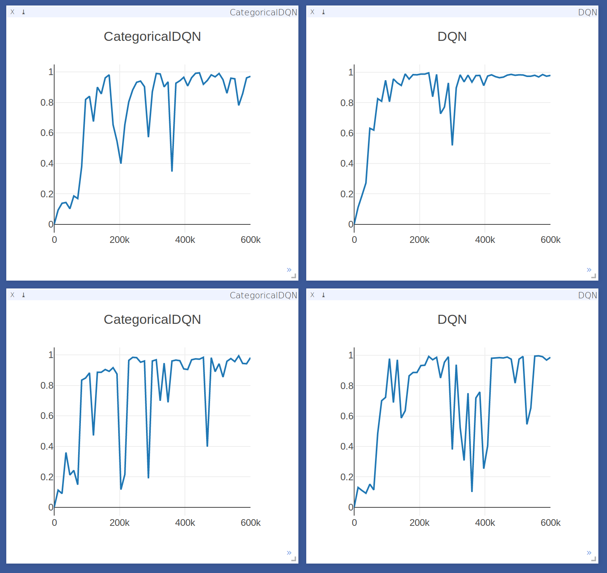

# Categorical DQN.

Implementation of the **Categorical DQN** as described in *A distributional
Perspective on Reinforcement Learning*.

Thanks to [@tudor-berariu](https://github.com/tudor-berariu) for optimisation
and training tricks and for catching two nasty bugs.

## Dependencies

You can take a look in the [env export file](categorical.yml) for the full
list of dependencies.

Install the game of Catch:
```
git clone https://github.com/floringogianu/gym_fast_envs
cd gym_fast_envs

pip install -r requirements.txt
pip install -e .
```

Install `visdom` for reporting: `pip install visdom`.

## Training

First start the `visdom` server: `python -m visdom.server`. If you don't want to install or use `visdom` make sure you deactivate the `display_plots` option in the `configs`.

Train the Categorical DQN with `python main.py -cf configs/catch_categorical.yaml`.

Train a DQN baseline with `python main.py -cf configs/catch_dqn.yaml`.

## To Do

- [x] Migrate to `Pytorch 0.2.0`. Breaks compatibility with `0.1.12`.
- [x] Add some training curves.
- [x] Run on Atari.
- [x] Add proper evaluation.

## Results

First row is with batch size of 64, the second with 32. Will run on more seeds and average for a better comparison. Working on adding Atari results.


